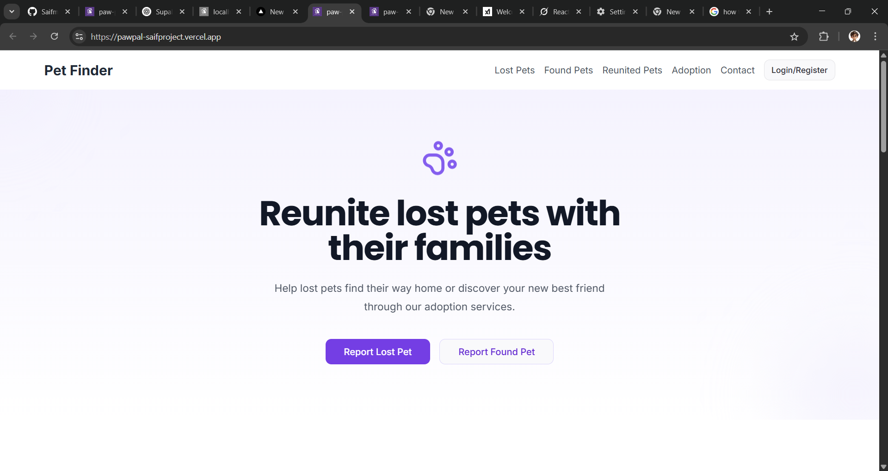
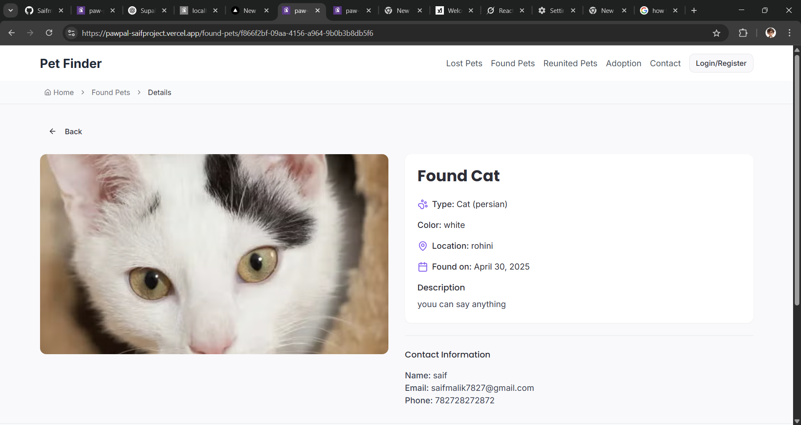
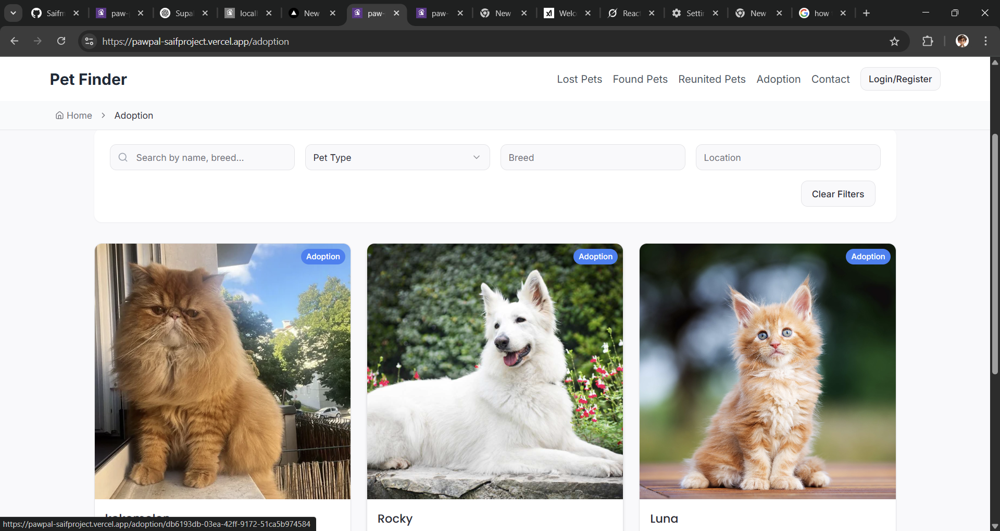
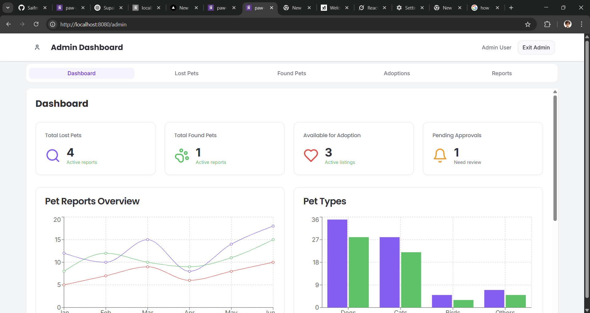
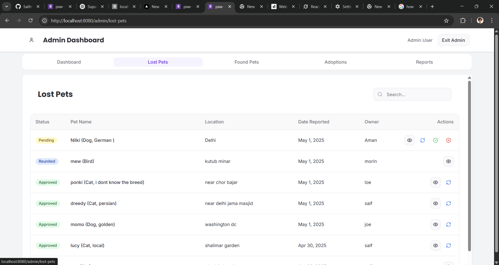
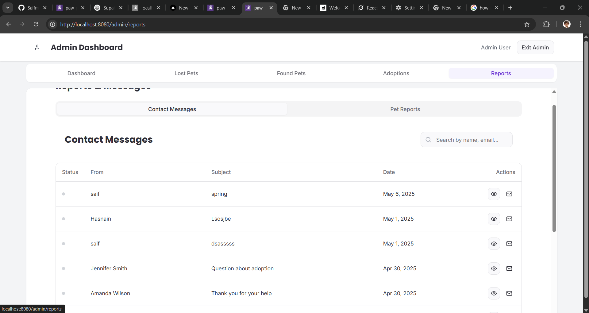

# 🐾 PawPal – Find a Home for Every Paw!

PawPal is a full-stack pet rescue platform where people can report **lost** or **found** pets, **adopt** them, and help reunite furry friends with their families 🐶🐱. It also includes a secure **admin panel**, **authentication**, and real-time features with **Supabase** as the backend.

🔗 **Live Demo**: [your-deployed-link.com](https://your-deployed-link.com)  

---

## 📚 Table of Contents

- [Features](#features)
- [Tech Stack](#tech-stack)
- [Project Structure](#project-structure)
- [Screenshots](#screenshots)
- [Installation](#installation)
- [Usage Guide](#usage-guide)
- [Environment Variables](#environment-variables)
- [License](#license)

---

## ✨ Features

### 🏠 Home Page
A clean and informative landing page where users can learn what PawPal does and why it's important.



### 🔐 Authentication
- Built using **Supabase Auth**
- Sign in with email/password
- Secure routes for reporting pets or accessing the admin dashboard

### 📢 Lost Pets
- View all reported lost pets
- Filter and click on any pet to see full details
- Designed to help people quickly recognize their pets


### 🎯 Found Pets
- List of pets found by other people
- Helps reunite pets with their rightful owners
- Reports can include images, locations, and descriptions


### 🐾 Reunited Pets
- View pets that were lost and later found
- Success stories for the community

### 🏠 Adoption
- Browse adoptable pets
- Admin can upload pets available for adoption
- Great for shelters and individuals


### 📩 Contact Page
Simple contact form to allow users to send feedback, queries, or report issues

### 📝 Report Lost / Found Pet
- Only logged-in users can access
- Form to submit pet photo, description, location
- Data stored in Supabase database

### 🛠️ Admin Panel
- Admin-only access
- View, manage or delete any pet reports
- Secure route guarded via a flag (`adminOnly`)





### ❌ 404 Page
- Handles unknown routes
- Clean UX fallback

---

## 🛠️ Tech Stack

| Layer      | Tech                    |
|------------|-------------------------|
| Frontend   | React + Vite            |
| Styling    | Tailwind CSS, ShadCN    |
| Auth & DB  | Supabase                |
| State Mgmt | React Context API, React Query |
| UI         | Sonner, Tooltip, Lucide Icons |
| Routing    | React Router DOM        |

---

---

## ⚙️ Installation

Clone the repo and install dependencies:

```bash
git clone https://github.com/yourusername/pawpal
cd pawpal
npm install
npm run dev
````

---

## 🧪 Usage Guide

### 1. Visit Home Page

Browse available pages or log in to report pets.

### 2. Login / Signup

Signup using email/password via Supabase.

### 3. Report Lost Pet

Go to `/report-lost`, fill form with image and description, and submit.

### 4. Report Found Pet

Same as above, accessible at `/report-found`.

### 5. View Pet Details

Each pet listing has a `:id` route to view full details.

### 6. Admin Dashboard

If you are an admin (manually set in Supabase DB), you can access `/admin` to manage reports.

---

## 🔐 Environment Variables

Create a `.env` file:

```
VITE_SUPABASE_URL=https:supabase URL
VITE_SUPABASE_PUBLISHABLE_KEY= your publish key
VITE_SUPABASE_PROJECT_ID=your project ID
```

---

## 📝 License

This project is licensed under the MIT License.

---

## 🙏 Acknowledgements

* [Supabase](https://supabase.io/)
* [ShadCN UI](https://ui.shadcn.com/)
* [Lucide Icons](https://lucide.dev/)
* [React Query](https://tanstack.com/query/v4)

---

**Made with ❤️ by Saif**


